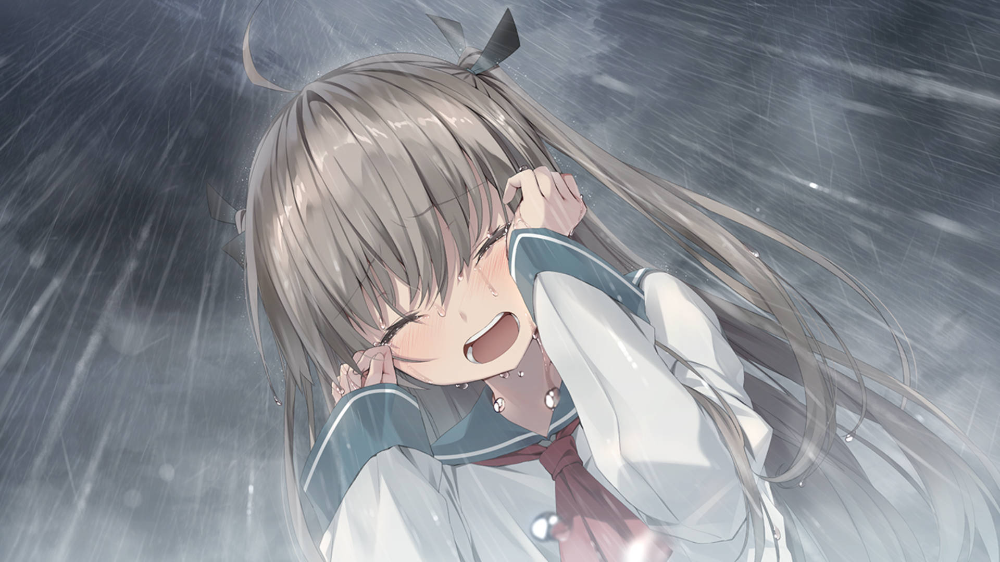
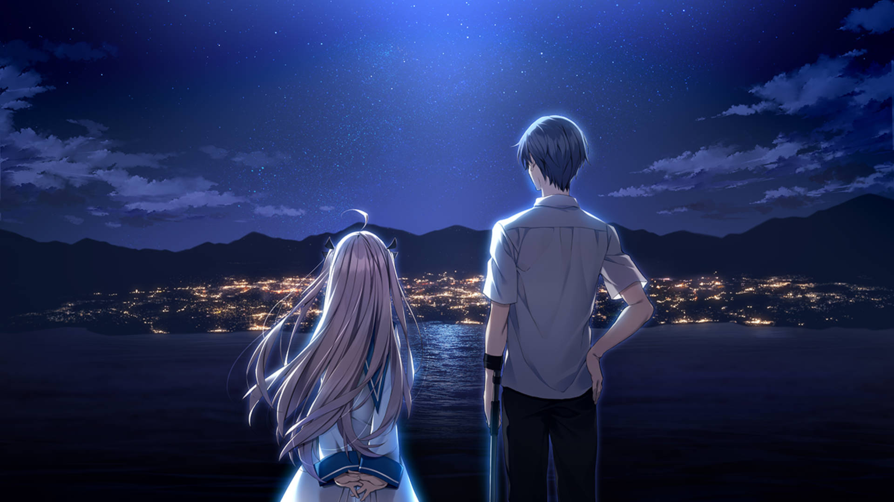
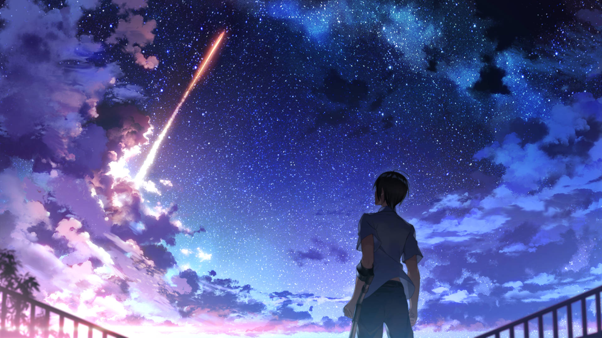
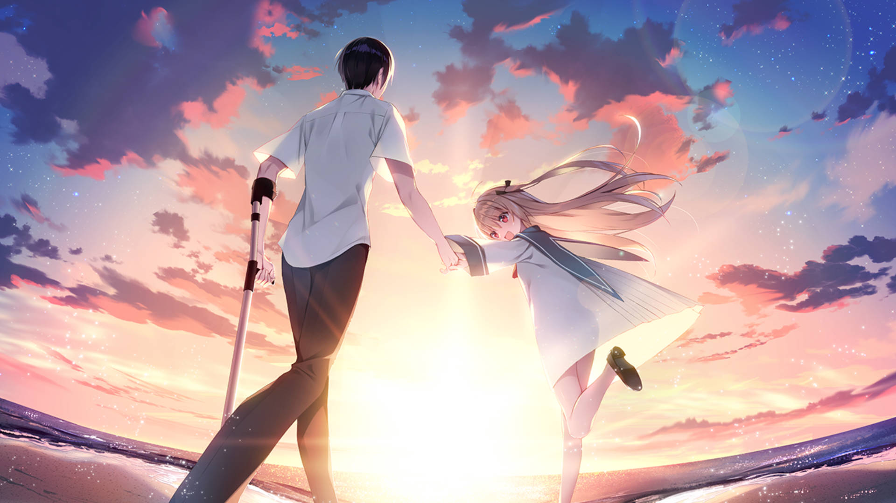

## 目录

## 前言

原作发行日期是 2020 年 6 月 19 日，TV 动画是 2024 年 7 月。其实从一开始就已经看到这部游戏铺天盖地的宣传，但当时并没有在意。直到 2022 年左右，一位线上好友向我强烈推荐后，我才将这部作品记下来，但始终没有开始行动。2024 年动画化的消息一出，再次吸引了我的注意，但由于没有推原作，所以动画搁置了。直到 2025 年 12 月心血来潮，遂花一个月的时间将其通关了，顺带看完了动画。

## 世界观

> 原因不明の海面上昇によって、地表の多くが海に沈んだ近未来。

海平面上升之后的世界会是什么样的呢？这部作品设定在近未来，人类的生存环境受到极大威胁，陆地淹没大半，文明倒退到连发电都无法维持的地步。

> 幼い頃の事故によって片足を失った少年・斑鳩夏生[いかるがなつき]は、都市での暮らしに見切りを付け、海辺の田舎町へと移り住んだ。  
> 身よりのない彼に遺されたのは、海洋地質学者だった祖母の船と潜水艇、そして借金。  
> 夏生は“失った未来”を取り戻すため、謎の借金取り・キャサリンと共に、祖母の遺産が眠るという海底の倉庫を目指して潜る。

主人公夏生在小时候失去了一条腿，因此需要机械义足的帮助。由于在研究院受到的创伤，夏生搬到了海边小镇，手上只有海洋地质学者外婆的船和潜艇，以及欠款。为了还清欠款，夏生只能跟迷之催债人——凯瑟琳一起打捞外婆留在海底仓库的遗产。

简单几句话说明了主人公的开局情况非常不乐观，既有童年的残酷遭遇，又有现在的经济问题。

> そこで見つけたのは、棺のような装置の中で眠る不思議な少女――アトリ。

少年在海底遇见了沉睡在密封舱的少女——亚托莉。非常经典的 Boy Meets Gril，可以想象的是这位少女将会彻底改变少年的人生。

> 彼女は、人間と見紛うほどに精巧で感情豊かなロボットだった。海底からサルベージされたアトリは言う。  
> 「マスターが残した最後の命令を果たしたいんです。それまで、わたしが夏生さんの足になります！」

少女是制作精良的仿生人，她想要完成主人留下的最后的命令，因此要来当少年的腿。少年和少女，人类和仿生人将会如何相处呢。

整体来看，具有浓厚的软科幻小说色彩，同时也是传统的美少女作品。

## 剧情回放

### 沉眠海底的少女

夏生在打捞留在海底的遗产时，在那里遇到了沉睡在密封舱的仿生人美少女亚托莉，她的外表小巧可爱，如同精致的人偶。这场美好的相遇触动了夏生的心，而后与亚托莉在学校的日常更是萌发了其内心的恋爱之芽。

亚托莉虽是仿生人，但外表与人类并无二致，还拥有丰富的情感表现。个子娇小却力大无比，时而温柔，时而嬉闹，跟她在一起总能有数不尽的欢乐，这样的双马尾萝莉有谁不爱呢。

### 雨中哭泣

这段剧情是整个故事的高潮所在，亚托莉由此才真正发觉到自己的内心，也是主人公与亚托莉关系的转折点。剧中唯一的反派角色安田终于出手了，在学校将水菜萌等师生扣为人质，要求他们交出亚托莉。亚托莉接到凛凛花的通知，不顾此前凯瑟琳下达的禁止来学校的命令，决定去学校救人。安田原是设计亚托莉博士的徒弟，为洗刷已故恩师的污点想要暴力拆除所谓有缺陷的仿生人。而亚托莉就是他要回收的目标，显然一场激烈的冲突已不可避免。

当亚托莉看到夏生被安田攻击时，开始失控猛烈攻击了安田。黑化的她似乎被愤怒占据着，明明被说是没有内心的仿生人，却自行发动了攻击人类的行为。之后夏生的一番解释证明了亚托莉是有内心的，是知晓喜悦、悲伤为何物的仿生人。亚托莉解除了内心的封印，失声痛哭起来，泪水奔涌而出，而此时下起了激烈的大雨。定格到这个画面，亚托莉在雨中尽情宣泄自己的悲伤。这一幕非常触动人心，再加上美少女的外表则更加惹人怜悯。原来仿生人也是和人一样拥有内心的啊！

### 最后的离别

在分别前夕，水菜萌提议要给亚托莉举办送别会时，本该是一件开心的事情，可是亚托莉却拒绝了。理由是与伙伴们分别感到十分难过，同时亚托莉对自己拥有内心这件事开始感到不安。之后，二人在海底深处回忆母亲的那番对话当中，亚托莉深切地领会了悲伤。而夏生的一番话解开了亚托莉心中的心结，母亲其实一直想要向亚托莉道歉，可惜未能如愿就撒手人寰。感到悲伤其实并不是一件坏事，换个角度看，不知喜悦就不知悲伤，此刻有多么悲伤正是说明以往那段日子是有多么愉快。

送别会上，亚托莉将夏生托付给了水菜萌。水菜萌是个善解人意的好女孩，她当然知道这意味着什么。虽然，夏生的心一直属于亚托莉，但很遗憾亚托莉并不能陪伴他走完剩下的人生，而这段的空白只能由水菜萌来填补。以夏生的性格来看，他的心已经给了亚托莉，是不可能再给其他人，也只有水菜萌愿意一心一意陪伴。

当亚托莉决定在伊甸完成自己的使命时，离别的时刻终于到来。这种滋味最令人痛心，夏生也不例外，毕竟是自己的初恋，一起共同度过了 44 个美好的夏日。每一分一秒都叫人难以忍受，但还是要接受她的决定。夜幕下，二人站在伊甸岛上望着对岸，漆黑的海边小镇重新点亮了灯光，非常美丽的一幕。

在和大家看完火箭升空之后，夏生此刻也找到了自己的未来，那就是返回研究院继续深造。他和亚托莉还有约定，那就是拯救地球。凛凛花深受感动下定决心要努力学习，跟上夏生老师的步伐。

### 真结局

六十年后，人类大半居住在数个海上浮游都市，仿生人也能作为朋友和人类共同相处，这一切都有夏生的功劳。当初的约定，拯救地球也一直在履行。身患重病的他躺在病床上，临终心愿就是见亚托莉最后一面，而这一天伊甸将要结束自己的使命，正式退出历史舞台。夏生通过大脑链接到伊甸的网络节点，终于见到了阔别已久的亚托莉，她的外表如故，而此时夏生却垂垂老矣，不得已用了当初少年的模样。这一天是亚托莉的最后一天，也是二人度过的第 45 个夏日。

如果说临终之日能够和最爱的人一起度过，那肯定非常幸福的。虽然和亚托莉相伴的日子只有 44 天，但这珍贵的回忆支撑着夏生一直不断前进。
